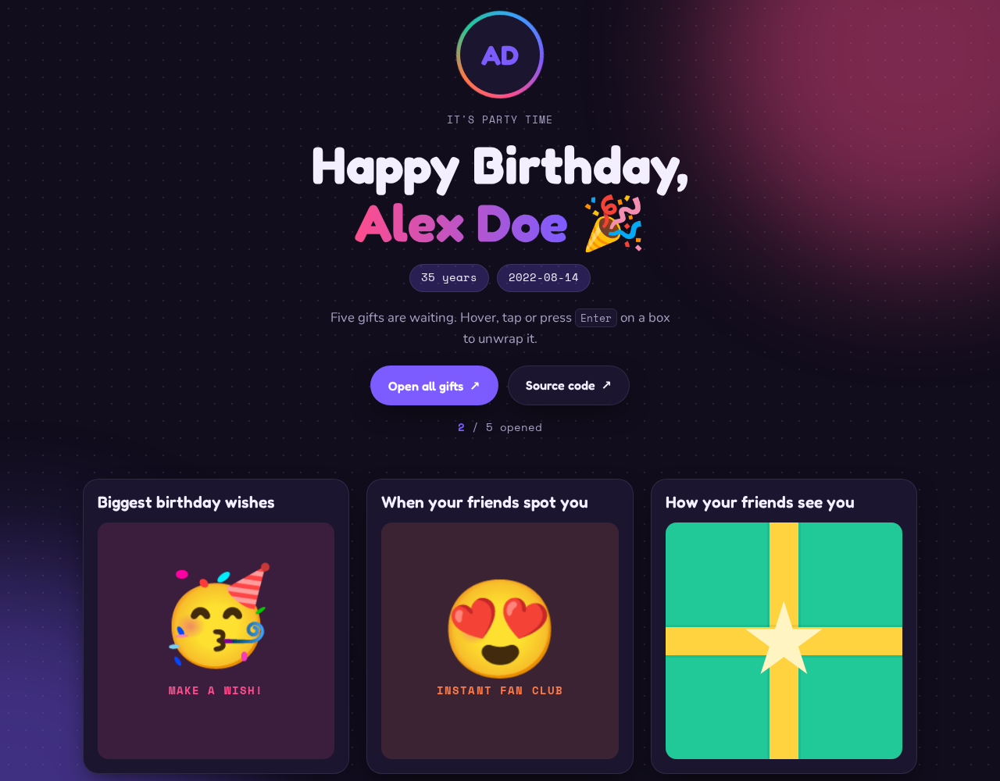

# Birthday Gift Card

An interactive birthday card where you unwrap five gift boxes to reveal animated surprises and confetti.

**[Live demo](https://brutall100.github.io/scrimba-birthday-gift/)** · **[Source code](https://github.com/brutall100/scrimba-birthday-gift)**



## About

This started as a small Scrimba practice project: a birthday page for a friend where hovering over a gift reveals a GIF. I rebuilt it as a polished portfolio piece. The gifts are now drawn with CSS, the surprises are animated emoji, and the page works with a mouse, a touch screen or a keyboard. The birthday person is a made-up demo profile, Alex Doe.

## Features

- Five CSS-drawn gift boxes that unwrap on hover, tap, click or <kbd>Enter</kbd>
- A confetti burst each time a gift opens, made with the Web Animations API
- "Open all gifts" / "Wrap them up" button and a live opened counter
- A dot-grid background with slowly drifting colour glows
- Light and dark themes that follow the system setting, plus a manual toggle that is remembered
- Responsive layout that works from 390px phones up to desktop
- Accessible: real `<button>` elements, `aria-expanded`, a visible `:focus-visible` ring and `prefers-reduced-motion` support
- No images and no dependencies, so the page is only a few kilobytes

## Built with

- HTML5
- CSS3 (custom properties, grid, `clip-path`, `color-mix`, keyframe animations)
- Vanilla JavaScript (Web Animations API, `matchMedia`)
- Google Fonts: Fredoka, Nunito and Space Mono

## What I learned

- Drawing shapes with plain CSS (`clip-path` for the bow, pseudo-elements for the ribbon)
- Why hover-only interactions fail on phones, and how to support touch and keyboard as well
- Building light and dark themes with CSS custom properties and `prefers-color-scheme`
- Respecting `prefers-reduced-motion` so animations don't bother people who turn them off
- Creating short-lived confetti with `element.animate()` and cleaning it up afterwards

## Run it locally

```bash
git clone https://github.com/brutall100/scrimba-birthday-gift.git
cd scrimba-birthday-gift
# open index.html in your browser, or serve it:
npx serve .
```

## Project structure

```
.
├── index.html        # page markup
├── style.css         # theme tokens, layout and animations
├── script.js         # gift logic, confetti and theme toggle
├── docs/
│   └── screenshot.png
└── README.md
```

## Credits

- Original project idea from the [Scrimba](https://scrimba.com) Frontend Developer course
- Emoji rendered by your system's emoji font
- Fonts from [Google Fonts](https://fonts.google.com)
